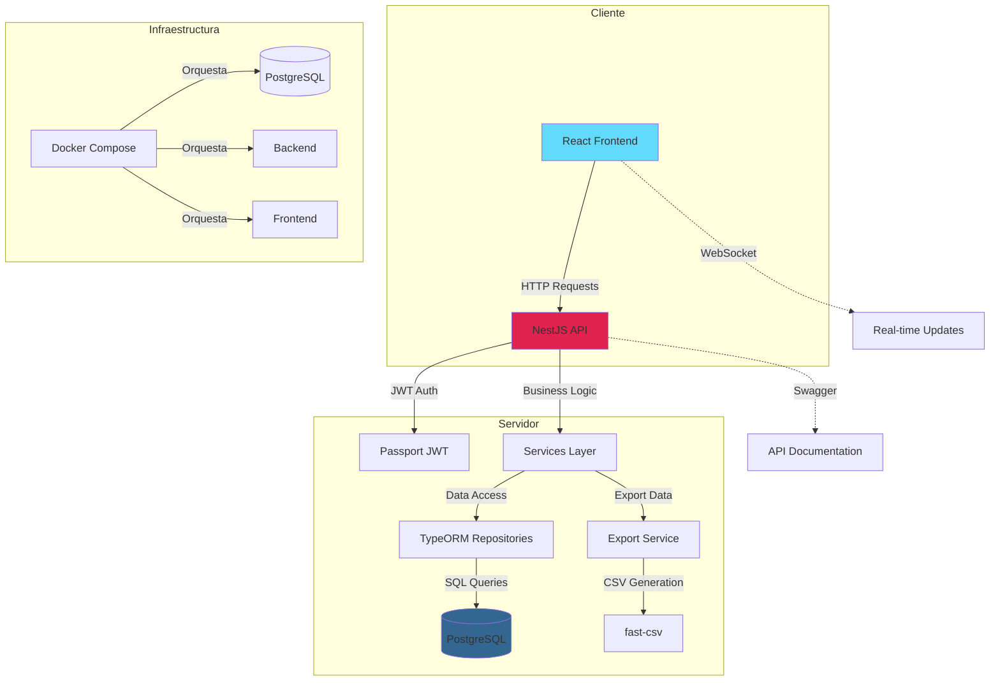
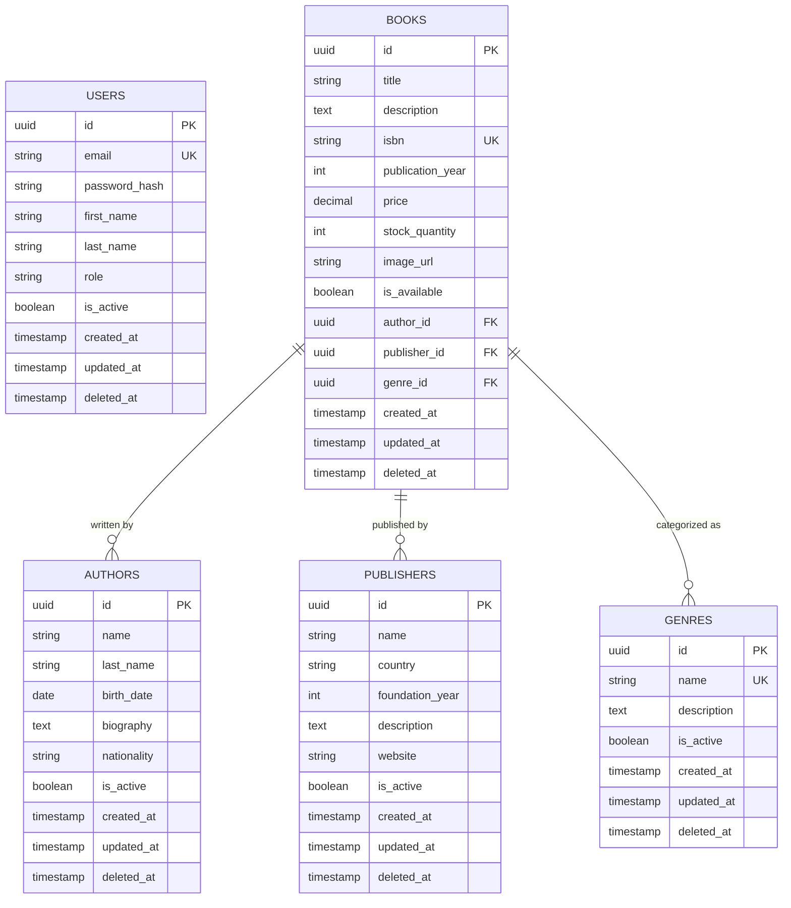

# 📚 CMPC Book Management System

Una aplicación web completa para la gestión de libros, autores, editoriales y géneros, desarrollada con tecnologías modernas y diseñada para facilitar el control de inventarios bibliográficos.

### ✨ Características Principales

- **Gestión completa de libros**: CRUD completo con información detallada
- **Gestión de autores**: Mantener un catálogo organizado de autores
- **Gestión de editoriales**: Control sobre las casas editoriales
- **Gestión de géneros**: Categorización de los libros
- **Búsqueda y filtrado avanzado**: Encontrar libros rápidamente
- **Exportación a CSV**: Generar reportes con los datos actuales
- **Autenticación segura**: Sistema de login con JWT
- **Interfaz moderna y responsiva**: Diseñada con Material-UI
- **API RESTful**: Backend bien estructurado con NestJS

## 🚀 Tecnologías Utilizadas

### Backend (NestJS)
- **Framework**: NestJS - Por su arquitectura modular y escalable
- **Lenguaje**: TypeScript - Para mayor seguridad de tipos
- **Base de datos**: PostgreSQL - Confiabilidad y rendimiento
- **ORM**: TypeORM - Facilita las operaciones con la base de datos
- **Autenticación**: Passport JWT - Seguridad robusta
- **Documentación**: Swagger - API bien documentada
- **Testing**: Jest - Pruebas unitarias y de integración

### Frontend (React)
- **Framework**: React 18 - Por su flexibilidad y ecosistema
- **Lenguaje**: TypeScript - Consistencia con el backend
- **Build Tool**: Vite - Velocidad de desarrollo
- **UI Framework**: Material-UI (MUI) - Componentes profesionales
- **Estado**: Zustand - Gestión simple y eficaz del estado
- **Estilos**: Tailwind CSS - Utilidades rápidas y consistentes
- **Query**: TanStack Query - Gestión eficiente de datos del servidor
- **Navegación**: React Router - SPA fluida

### Infraestructura
- **Contenedores**: Docker - Despliegue consistente
- **Orquestación**: Docker Compose - Desarrollo local fácil
- **Base de datos**: PostgreSQL 15 - Última versión estable

## 📋 Prerrequisitos

Antes de comenzar, asegúrate de tener instalado:

- **Node.js** (v18 o superior) y npm
- **Docker** y Docker Compose (opcional pero recomendado)
- **Git** para clonar el repositorio

## 🔧 Instalación y Configuración

### Desarrollo con Docker (Recomendado)

#### 1. Clonar y construir
```bash
git clone <url-del-repositorio>
cd cmpc
docker-compose up --build
```

Esto iniciará:
- PostgreSQL en el puerto 5432
- Backend en el puerto 3001
- Frontend en el puerto 5173

#### 2. Verificar la instalación
- Frontend: http://localhost:5173
- Backend API: http://localhost:3001/api
- Documentación API: http://localhost:3001/api/docs

## 📖 Guía de Uso

### Primeros Pasos

1. **Acceder a la aplicación**: Abre tu navegador en http://localhost:5173
2. **Registrarse**: Crea una cuenta nueva o usa las credenciales de prueba 
3. **Explorar**: Navega por las diferentes secciones de la aplicación

### Gestión de Libros

#### Agregar un nuevo libro
1. Haz clic en "Nuevo Libro"
2. Completa el formulario con:
   - Título del libro
   - Descripción
   - ISBN
   - Año de publicación
   - Precio
   - Cantidad en stock
   - Autor (seleccionar o crear)
   - Editorial (seleccionar o crear)
   - Género (seleccionar o crear)
3. Haz clic en "Guardar"

#### Buscar y filtrar
- **Búsqueda por texto**: Usa la barra de búsqueda para encontrar por título o descripción
- **Filtros avanzados**: 
  - Filtrar por autor
  - Filtrar por editorial
  - Filtrar por género
  - Rango de precios
  - Solo libros disponibles

#### Exportar a CSV
1. Aplica los filtros deseados (opcional)
2. Haz clic en "Exportar a CSV"
3. El archivo se descargará automáticamente con el nombre `libros_YYYYMMDD.csv`
4. El archivo incluye todos los libros visibles con sus datos completos

### Gestión de Autores, Editoriales y Géneros

Cada sección funciona de manera similar:
1. **Listado**: Muestra todos los registros activos
2. **Agregar**: Formulario para nuevos registros
3. **Editar**: Modificar información existente
4. **Eliminar**: Desactivar registros (borrado lógico)

## 🏗️ Arquitectura y Decisiones de Diseño

### Filosofía de Desarrollo

Cuando diseñé este sistema, me enfoqué en varios principios clave:

1. **Separación de responsabilidades**: Cada módulo tiene una función específica
2. **Escalabilidad**: La arquitectura permite crecer sin refactorizaciones mayores
3. **Mantenibilidad**: Código limpio y bien documentado
4. **Seguridad**: Autenticación robusta y validaciones en múltiples capas
5. **UX intuitiva**: Interfaz que no requiere manual de uso

### Arquitectura del Sistema



### Patrones de Diseño Implementados

#### Backend (NestJS)
- **Dependency Injection**: Inyección de dependencias para mayor flexibilidad
- **Repository Pattern**: Abstracción del acceso a datos
- **DTO Pattern**: Transferencia de datos entre capas
- **Service Layer Pattern**: Lógica de negocio centralizada
- **Controller Pattern**: Endpoints REST bien organizados

#### Frontend (React)
- **Component Composition**: Componentes reutilizables y modulares
- **Custom Hooks**: Lógica compartida entre componentes
- **State Management**: Zustand para estado global simple
- **Query Management**: TanStack Query para caché y sincronización
- **Form Handling**: React Hook Form con validación Yup

### Seguridad

- **Autenticación JWT**: Tokens seguros con expiración
- **Hashing de contraseñas**: bcrypt con salt rounds apropiados
- **Validación de entrada**: En frontend y backend
- **CORS configurado**: Solo orígenes permitidos
- **Rate limiting**: Previene ataques de fuerza bruta

## 🗄️ Modelo de Base de Datos

### Diagrama Entidad-Relación



### Esquema SQL Detallado

```sql
-- Tabla de Usuarios (Sistema de Autenticación)
CREATE TABLE users (
    id UUID PRIMARY KEY DEFAULT uuid_generate_v4(),
    email VARCHAR(255) UNIQUE NOT NULL,
    password_hash VARCHAR(255) NOT NULL,
    first_name VARCHAR(100) NOT NULL,
    last_name VARCHAR(100) NOT NULL,
    role VARCHAR(50) DEFAULT 'USER' CHECK (role IN ('USER', 'ADMIN')),
    is_active BOOLEAN DEFAULT true,
    created_at TIMESTAMP DEFAULT CURRENT_TIMESTAMP,
    updated_at TIMESTAMP DEFAULT CURRENT_TIMESTAMP,
    deleted_at TIMESTAMP NULL
);

-- Tabla de Autores
CREATE TABLE authors (
    id UUID PRIMARY KEY DEFAULT uuid_generate_v4(),
    name VARCHAR(100) NOT NULL,
    last_name VARCHAR(100) NOT NULL,
    birth_date DATE,
    biography TEXT,
    nationality VARCHAR(100),
    is_active BOOLEAN DEFAULT true,
    created_at TIMESTAMP DEFAULT CURRENT_TIMESTAMP,
    updated_at TIMESTAMP DEFAULT CURRENT_TIMESTAMP,
    deleted_at TIMESTAMP NULL
);

-- Tabla de Editoriales
CREATE TABLE publishers (
    id UUID PRIMARY KEY DEFAULT uuid_generate_v4(),
    name VARCHAR(200) NOT NULL,
    country VARCHAR(100),
    foundation_year INTEGER CHECK (foundation_year >= 1000 AND foundation_year <= EXTRACT(YEAR FROM CURRENT_DATE)),
    description TEXT,
    website VARCHAR(255),
    is_active BOOLEAN DEFAULT true,
    created_at TIMESTAMP DEFAULT CURRENT_TIMESTAMP,
    updated_at TIMESTAMP DEFAULT CURRENT_TIMESTAMP,
    deleted_at TIMESTAMP NULL
);

-- Tabla de Géneros
CREATE TABLE genres (
    id UUID PRIMARY KEY DEFAULT uuid_generate_v4(),
    name VARCHAR(100) UNIQUE NOT NULL,
    description TEXT,
    is_active BOOLEAN DEFAULT true,
    created_at TIMESTAMP DEFAULT CURRENT_TIMESTAMP,
    updated_at TIMESTAMP DEFAULT CURRENT_TIMESTAMP,
    deleted_at TIMESTAMP NULL
);

-- Tabla de Libros (Entidad Principal)
CREATE TABLE books (
    id UUID PRIMARY KEY DEFAULT uuid_generate_v4(),
    title VARCHAR(255) NOT NULL,
    description TEXT,
    isbn VARCHAR(20) UNIQUE,
    publication_year INTEGER CHECK (publication_year >= 1000 AND publication_year <= EXTRACT(YEAR FROM CURRENT_DATE)),
    price DECIMAL(10,2) CHECK (price >= 0),
    stock_quantity INTEGER DEFAULT 0 CHECK (stock_quantity >= 0),
    image_url VARCHAR(500),
    is_available BOOLEAN DEFAULT true,
    author_id UUID NOT NULL,
    publisher_id UUID,
    genre_id UUID,
    created_at TIMESTAMP DEFAULT CURRENT_TIMESTAMP,
    updated_at TIMESTAMP DEFAULT CURRENT_TIMESTAMP,
    deleted_at TIMESTAMP NULL,
    
    -- Claves foráneas
    CONSTRAINT fk_books_author 
        FOREIGN KEY (author_id) REFERENCES authors(id) 
        ON DELETE RESTRICT ON UPDATE CASCADE,
    
    CONSTRAINT fk_books_publisher 
        FOREIGN KEY (publisher_id) REFERENCES publishers(id) 
        ON DELETE SET NULL ON UPDATE CASCADE,
    
    CONSTRAINT fk_books_genre 
        FOREIGN KEY (genre_id) REFERENCES genres(id) 
        ON DELETE SET NULL ON UPDATE CASCADE
);
```

### Decisiones de Diseño de Base de Datos

1. **UUIDs como IDs**: Mayor seguridad y facilidad para sistemas distribuidos
2. **Soft Delete**: Mantener integridad histórica de datos
3. **Índices estratégicos**: Optimización de consultas frecuentes
4. **Constraints apropiadas**: Integridad de datos a nivel de base de datos
5. **Timestamps**: Auditoría completa de operaciones

## 💭 Proceso de Desarrollo y Pensamiento

### Fase de Planificación

Cuando comencé este proyecto, primero identifiqué los requisitos principales:
- Necesitaba un sistema completo de gestión de libros
- Tenía que ser fácil de usar
- Debía ser escalable y mantenible
- Requería funcionalidades avanzadas como exportación de datos

### Diseño de la Arquitectura

Decidí usar una arquitectura de tres capas:
1. **Frontend**: React con TypeScript para una experiencia de usuario rica
2. **Backend**: NestJS para una API robusta y bien estructurada
3. **Base de datos**: PostgreSQL para confiabilidad y rendimiento

### Desarrollo Incremental

El desarrollo siguió este orden lógico:

1. **Configuración del proyecto**: Establecer la estructura base
2. **Modelo de datos**: Diseñar el esquema de base de datos
3. **Backend API**: Implementar los endpoints necesarios
4. **Frontend**: Construir la interfaz de usuario
5. **Integración**: Conectar frontend con backend
6. **Funcionalidades avanzadas**: Exportación CSV, filtros, búsqueda
7. **Testing**: Pruebas unitarias y de integración
8. **Documentación**: README completo y documentación de API

### Desafíos y Soluciones

#### Desafío: Exportación CSV con caracteres especiales
**Solución**: Implementé codificación UTF-8 con BOM para compatibilidad con Excel

#### Desafío: Gestión de estado complejo en el frontend
**Solución**: Usé Zustand para estado global y TanStack Query para caché de servidor

#### Desafío: Relaciones complejas entre entidades
**Solución**: Diseñé un esquema de base de datos bien normalizado con claves foráneas apropiadas

### Lecciones Aprendidas

1. **Planificación es clave**: Pasar tiempo diseñando la arquitectura ahorra tiempo en desarrollo
2. **TypeScript es invaluable**: La seguridad de tipos previene muchos errores
3. **Testing temprano**: Escribir pruebas desde el principio facilita el mantenimiento
4. **Documentación continua**: Documentar mientras se desarrolla es más eficiente

## 🔮 Mejoras Futuras

- **Autenticación social**: Login con Google, Facebook, etc.
- **Importación de datos**: Carga masiva desde CSV/Excel
- **Reportes avanzados**: Gráficos y estadísticas detalladas
- **Notificaciones**: Alertas de stock bajo, vencimientos, etc.
- **API móvil**: Aplicación móvil para gestión en movimiento
- **Multi-idioma**: Soporte para múltiples idiomas
- **Préstamos de libros**: Sistema de gestión de préstamos
- **Reseñas y calificaciones**: Los usuarios pueden calificar libros# cmpc_prueba
